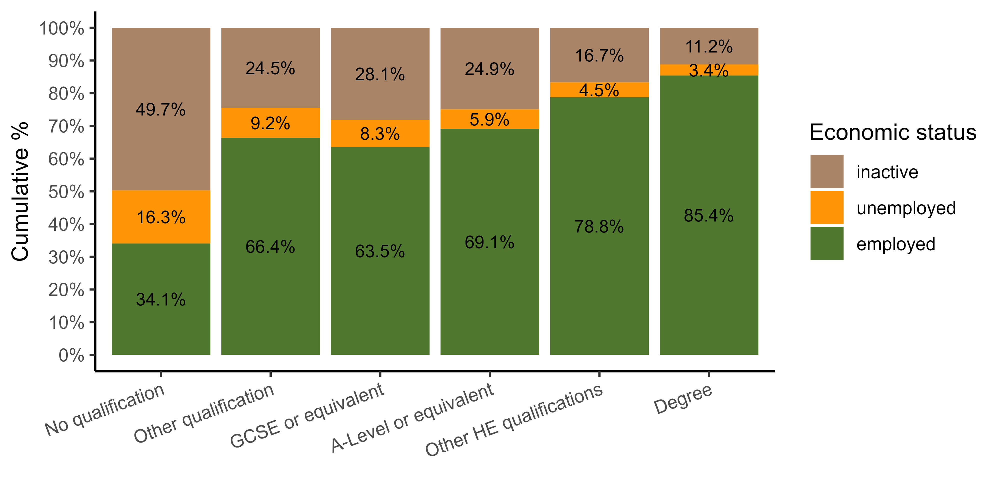

```{r setup, include=FALSE}
knitr::opts_chunk$set(echo = FALSE)

suppressPackageStartupMessages(library(knitr))
suppressPackageStartupMessages(library(here))
suppressPackageStartupMessages(library(ukhlsclean))
```

[Click here to go to the STAPM website](https://stapm.gitlab.io/Understanding_Society.html)

# The purpose of this document
To plot the data processed using functions in the [ukhlsclean](https://stapm.gitlab.io/r-packages/ukhlsclean/) package as part of the process of quality assurance of the preparation of input data used for econometric analyses of the relationship between smoking and work outcomes, and modelling of the impact on changing smoking prevalence on individual and aggregate labour market outcomes. The results presented here were generated from **version `r packageDescription("ukhlsclean", fields = "Version")`** of the package

# Background
The [Understanding Society - the UK Household Longitudinal Study (UKHLS)](https://www.understandingsociety.ac.uk/) (USoc hereafter) is a longitudinal survey of households and individuals representative of the UK population based at the Institute for Social and Economic Research (ISER). It is a successor to the British Household Panel Survey (BHPS) which ran for 18 waves between 1991-2008. USoc covers a wide range of topics including health and work.  

This document refers to the Calendar Year 2020 data. This is a dataset derived from the main longitudinal dataset, designed to be representative of the UK population for the single year of 2020 in order to facilitate specific year cross-sectional analyses. Calendar year 2020 draws on data from the 10th, 11th, and 12th waves of Understanding Society, and contains only variables which were included in all three waves. 

# Data checks conducted

Data checks are conducted on the UKHLS 2020 data, making use of the survey weights in the data to adjust for survey design and non-response. Totals are further adjusted using a scaling factor to gross the totals up to the full UK population aged 16-89, based on ONS mid-year estimates of the total population size by age and sex.    

**Distribution of educational attainment**   

- Distribution of highest qualification attained for (a) the overall population aged 16 to 89 years, (b) by sex, and (c) by 5-year age categories for all over-24s.

**Distribution of employment status** 

Economic status plots are restricted to working-aged individuals - 16-64 year olds.

- Employment, unemployment, and inactivity rates by (a) sex, (b) 5-year age category, (c) qualification, and (d) smoking status. 

**Distribution of gross real earnings**   

The main variable considered here is real gross annual earnings. Annual earnings are obtained by multiplying the monthly earnings variable by 12. Understanding Society top-codes derived income variables, and earnings are top-coded at £100,000 per annum.

- Employed individuals only - self-employed individuals are excluded. 
- Earnings from employment only - any self-employment earnings by the employed are excluded.
- Unless otherwise stated, descriptive plots and statistics are based on usual monthly pay, rather than last payment. 

# Results

## Distribution of educational attainment

```{r ukhlsclean_edudist_sex, echo = F, out.width = "80%", fig.cap="Figure 1a. Distribution of educational attainment by sex."}

```


```{r ukhlsclean_edudist_age, echo = F, out.width = "100%", fig.cap="Figure 1b. Distribution of educational attainment by age"}
include_graphics("USoc_calendar_year_2020_data_check/25_plots/01_highest_qual_by_age.png")
```

## Distribution of labour market status

```{r ukhlsclean_econdist_sex, echo = F, out.width = "80%", fig.cap="Figure 2a. Distribution of economic status by sex."}
include_graphics("USoc_calendar_year_2020_data_check/25_plots/02_econstat_by_sex.png")
```

```{r ukhlsclean_econdist_age, echo = F, out.width = "80%", fig.cap="Figure 2b. Distribution of economic status by age."}

```

```{r ukhlsclean_econdist_qual, echo = F, out.width = "80%", fig.cap="Figure 2c. Distribution of economic status by educational attainment."}

```


```{r ukhlsclean_econdist_smkstat, echo = F, out.width = "80%", fig.cap="Figure 2d. Distribution of economic status by smoking status."}

```

## Distribution of earnings

```{r ukhlsclean_earndist, echo = F, out.width = "80%", fig.cap="Figure 3a. Distribution of gross annual earnings."}
include_graphics("USoc_calendar_year_2020_data_check/25_plots/03_earnings_distribution.png")
```

<br/>  

# Reproducibility notes

- Data processed using [ukhlsclean](https://stapm.gitlab.io/r-packages/ukhlsclean/) version `r packageDescription("ukhlsclean", fields = "Version")` (accessible only to the project team)
- Code to clean the data using `ukhslcean` and to make these plots is in the repository https://gitlab.com/stapm/model-inputs/usoc_data (accessible only to the project team)


