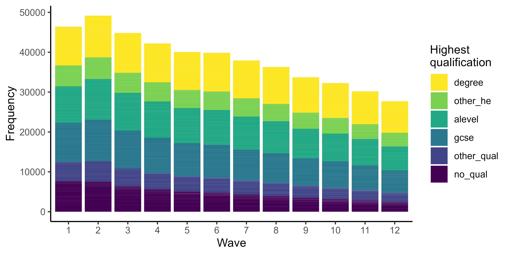
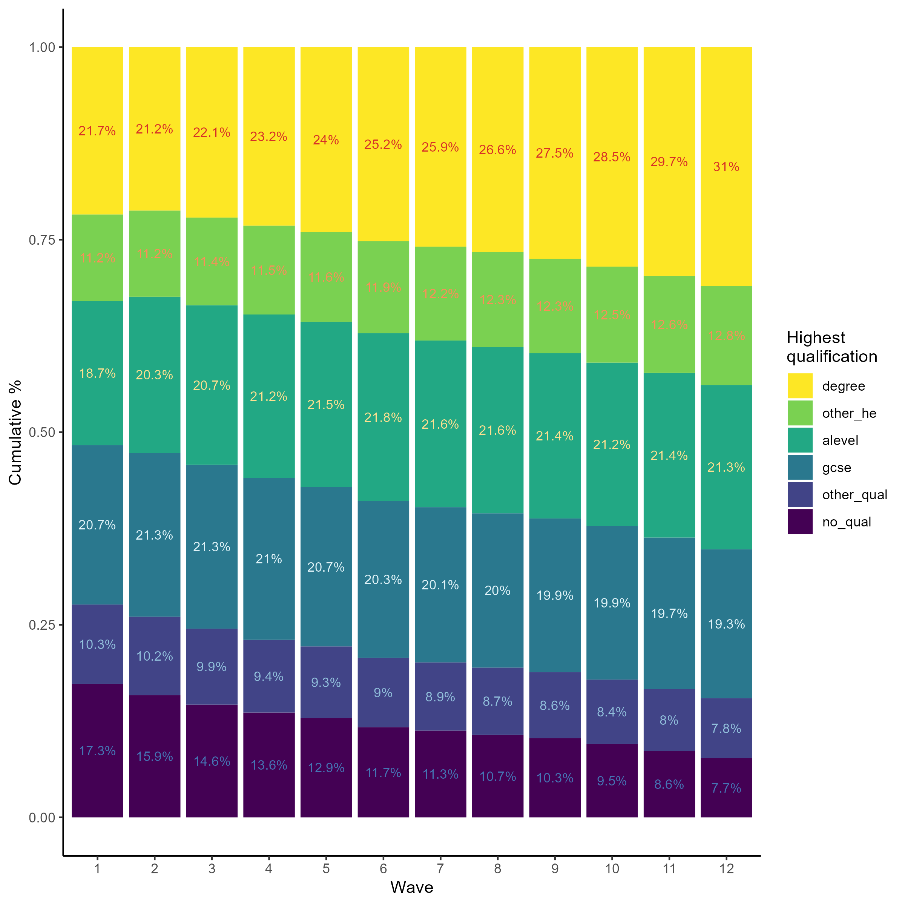
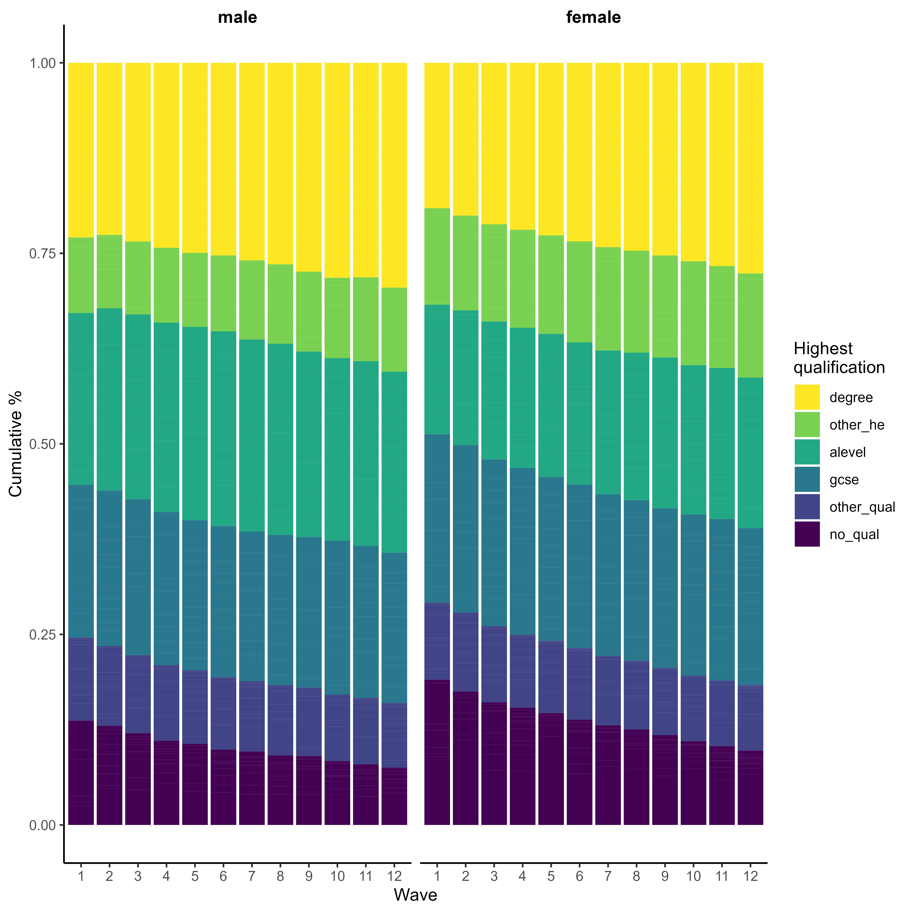
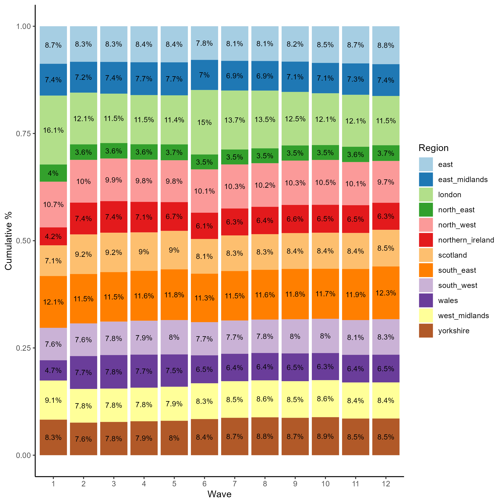
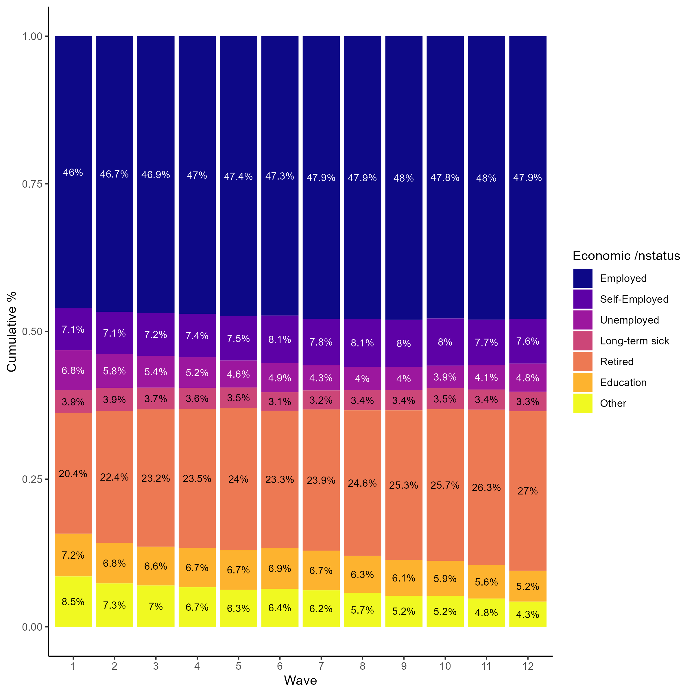
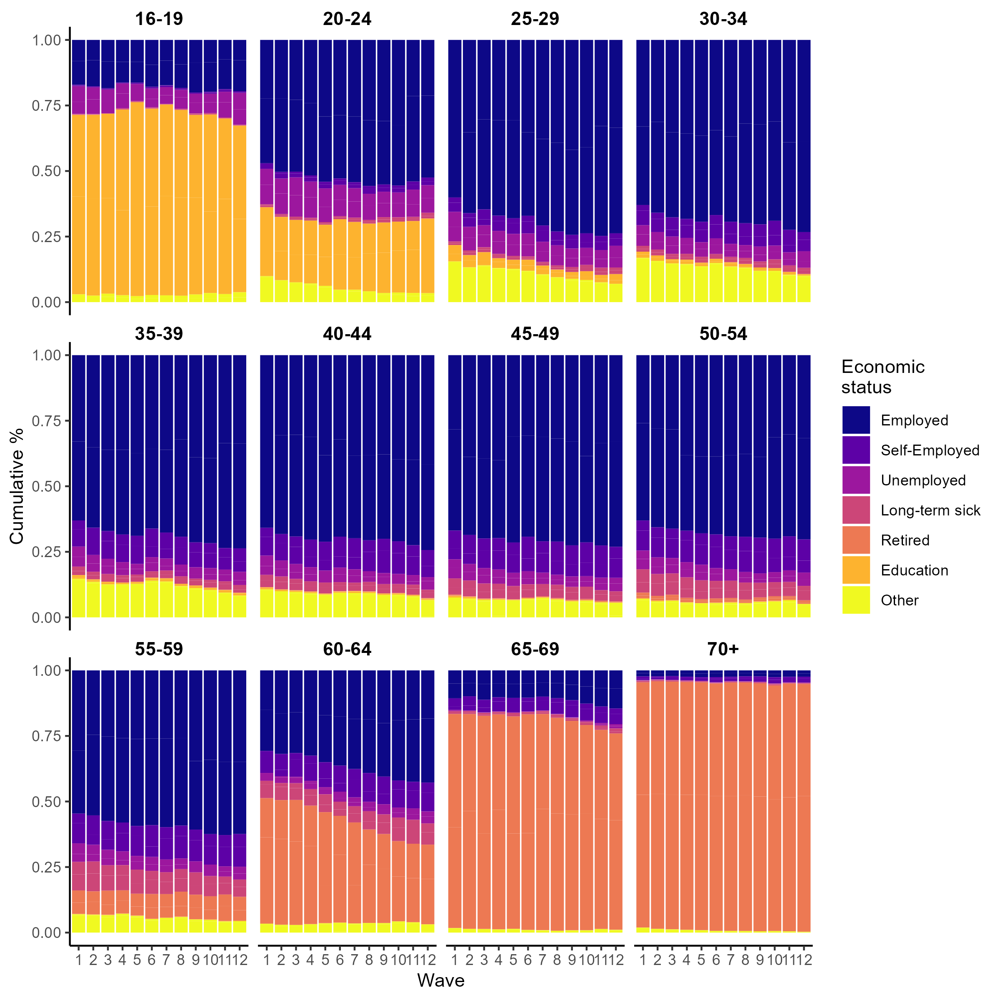
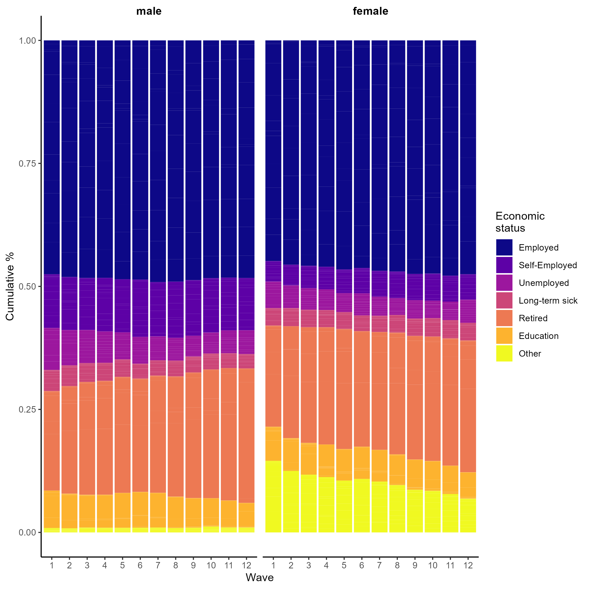

```{r setup, include=FALSE}
knitr::opts_chunk$set(echo = FALSE)

suppressPackageStartupMessages(library(knitr))
suppressPackageStartupMessages(library(here))
suppressPackageStartupMessages(library(ukhlsclean))
```

[Click here to go to the STAPM website](https://stapm.gitlab.io/Understanding_Society.html)

# The purpose of this document
To plot the data processed using functions in the [ukhlsclean](https://stapm.gitlab.io/r-packages/ukhlsclean/) package as part of the process of quality assurance of the preparation of input data to use in econometric modelling of the relationship between unhealthy behaviours (smoking, drinking) and individual labour market outcomes.   

# Background
The [Understanding Society - the UK Household Longitudinal Study (UKHLS)](https://www.understandingsociety.ac.uk/) (USoc hereafter) is a longitudinal survey of households and individuals representative of the UK population based at the Institute for Social and Economic Research (ISER). It is a successor to the British Household Panel Survey (BHPS) which ran for 18 waves between 1991-2008. USoc covers a wide range of topics including health and work.  

# Data checks conducted

Data checks are conducted on a pooled sample of all currently available waves (1-12) of the Understanding Society data. Survey weights are applied to adjust for survey design and non-response.    

# Results

## Education

The plots below show the distribution of individuals across levels of education, by wave and by subgroup.

```{r ukhlsclean_edu_1, echo = F, out.width = "100%", fig.cap="Figure 1. Counts by wave and highest qualification."}

```

```{r ukhlsclean_edu_2, echo = F, out.width = "100%", fig.cap="Figure 2. Distribution of highest qualification by wave."}

```

```{r ukhlsclean_edu_3, echo = F, out.width = "100%", fig.cap="Figure 3. Distribution of highest qualification by wave and sex."}

```

<br/>  

## Region

The plots below investigate regional variations in the Understanding Society data.   

```{r ukhlsclean_edu_4, echo = F, out.width = "100%", fig.cap="Figure 4. Distribution of individuals across regions by wave."}


```

## Labour market status

The plots below investigate the distribution of economic status of individuals across waves and by subgroup.

```{r ukhlsclean_lm_1, echo = F, out.width = "100%", fig.cap="Figure 5. Distribution of individuals across regions by wave."}


```

```{r ukhlsclean_lm_2, echo = F, out.width = "100%", fig.cap="Figure 6. Distribution of individuals across regions by wave."}


```

```{r ukhlsclean_lm_3, echo = F, out.width = "100%", fig.cap="Figure 7. Distribution of individuals across regions by wave."}


```

# Reproducibility notes

- Data processed using [ukhlsclean](https://stapm.gitlab.io/r-packages/ukhlsclean/) version `r packageDescription("ukhlsclean", fields = "Version")`


# References


